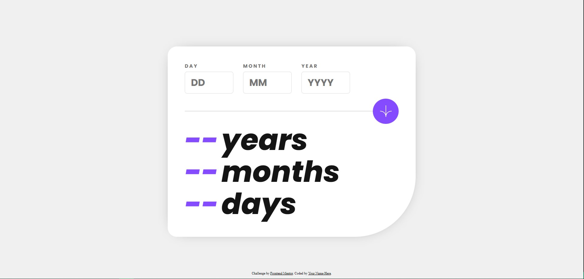
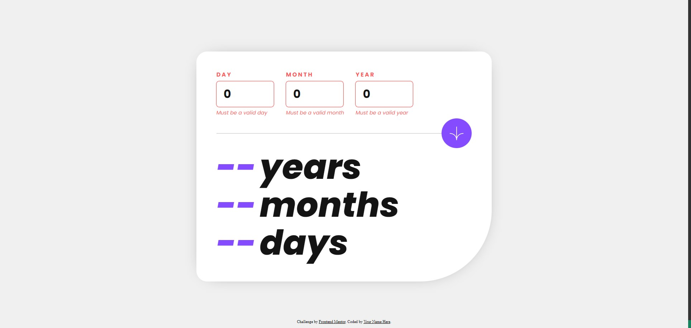
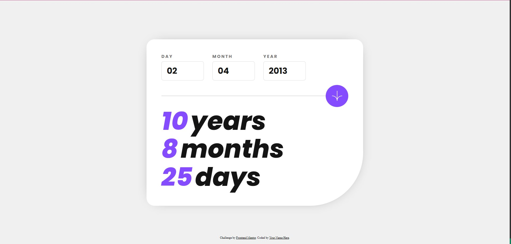
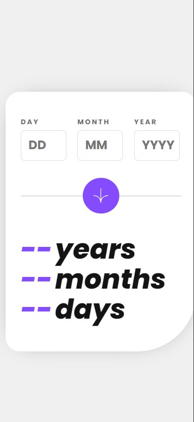

# Frontend Mentor - Age calculator app solution

This is a solution to the [Age calculator app challenge on Frontend Mentor](https://www.frontendmentor.io/challenges/age-calculator-app-dF9DFFpj-Q). Frontend Mentor challenges help you improve your coding skills by building realistic projects. 

## Table of contents

- [Overview](#overview)
  - [The challenge](#the-challenge)
  - [Screenshot](#screenshot)
  - [Links](#links)
  - [Built with](#built-with)
  - [What I learned](#what-i-learned)
  - [Continued development](#continued-development)
  - [Useful resources](#useful-resources)
- [Author](#author)


## Overview

### The challenge

Users should be able to:

- View an age in years, months, and days after submitting a valid date through the form
- Receive validation errors if:
  - Any field is empty when the form is submitted
  - The day number is not between 1-31
  - The month number is not between 1-12
  - The year is in the future
  - The date is invalid e.g. 31/04/1991 (there are 30 days in April)
- View the optimal layout for the interface depending on their device's screen size
- See hover and focus states for all interactive elements on the page
- **Bonus**: See the age numbers animate to their final number when the form is submitted

### Screenshot







### Links

- Live Site URL: [GitHub](https://amarcyclechurikoiraloiaghese.github.io/Age-calculator/)

### Built with

- Semantic HTML5 markup
- CSS custom properties
- Flexbox
- CSS Grid
- Javascript (Vanilla)

### What I learned

I finally learnt how to subtly manipulate animations through Javascript. 

See code below:

```js
let h1 = div.children[0];
let value = age[counter];
setTimeout(() =>
{
    h1.textContent = value;
    h1.classList.add("animate");
}, 10);
h1.textContent = "--";
h1.classList.remove("animate");
```

### Continued development

Since I improved at making animations, in future projects I will implement more animations myself.

### Useful resources

- [How to calculate age](https://www.javatpoint.com/calculate-age-using-javascript) - This is an amazing example which helped me finally understand how to calculate the age of person. I'd recommend it to anyone still learning this concept. Note: <code>getYear()</code> method should not be used anymore, instead use: <code>getFullYear()</code>.

## Author

- Frontend Mentor - [@AmarCycleChuriKoiraLoiaGhese](https://www.frontendmentor.io/profile/AmarCycleChuriKoiraLoiaGhese)
